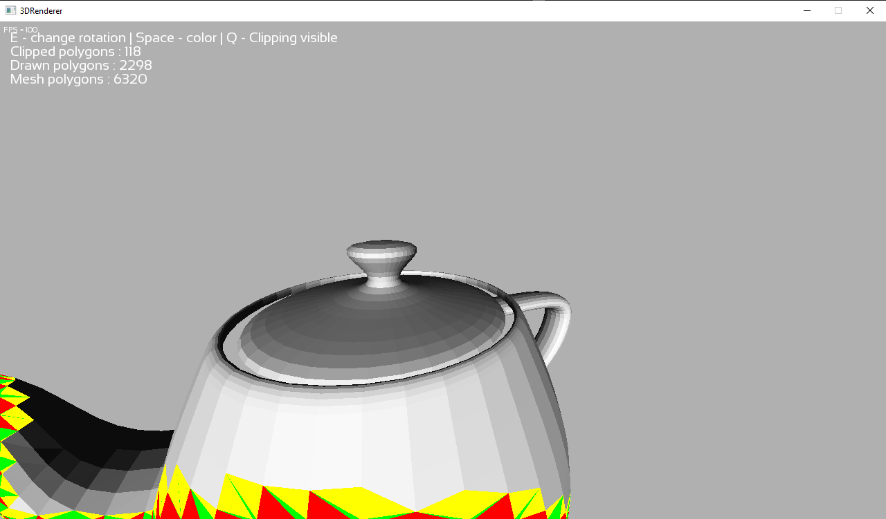

## About

A 3D renderer made from scratch in C++ with pure 2d SFML library.

Features :
- Orbital camera
- Simple lighting
- Support .obj files
- Clipping

Since i am having troubles with optimization, i stopped the project till i will learn more about modern C++ and achieve a better performance.  

Then there will be the following things to do :
- Texturing
- Better lighting
- Minecraft (heh)  
  

I was inspired by javidx9's excellent [series](https://www.youtube.com/watch?v=ih20l3pJoeU "series") about 3d graphics engine in console.  

