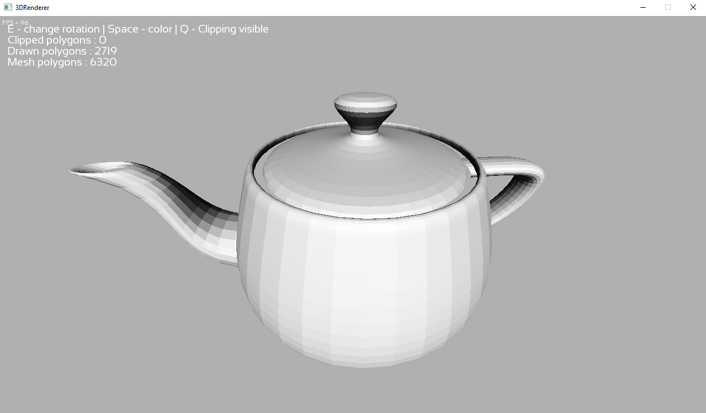

## About

A 3D renderer made from scratch in C++ with pure 2d SFML library.

Features :
- Orbital camera
- Simple lighting
- Support .obj files
- Clipping

Since i am having troubles with optimization, i stopped the project till i will learn more about modern C++ and achieve a better performance. 
 
Then there will be the following things to do :
- Texturing
- Better lighting
- Minecraft (heh)

